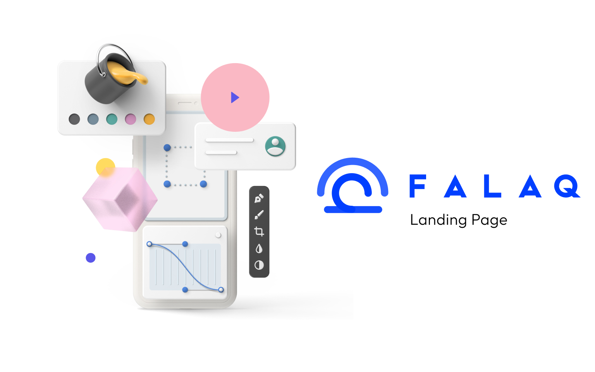

<h1 align="center">
  Falaq
</h1>

<p align="center">
  
  
  
  
  

  <a href="https://github.com/humbruno/url-shortener/commits/master">
    
  </a>
  
  <a href="https://github.com/humbruno/falaq/issues">
    
  </a>
</p>

<p align="center">
  
</p>

## 💻 Project

Falaq Landing Page

Dependencies used for this project:

- [Next.js](https://vitejs.dev/)
- [TypeScript](https://www.typescriptlang.org/)
- [Contentful](https://shrtco.de/)

## 🔌 Live Website Link

- [Live Website](https://brunosantos.dev/)

## 📥 Installing and executing

Clone this repository and access the directory.

```bash
# Installing dependencies
$ npm install

# Executing the application
$ npm run dev
```
